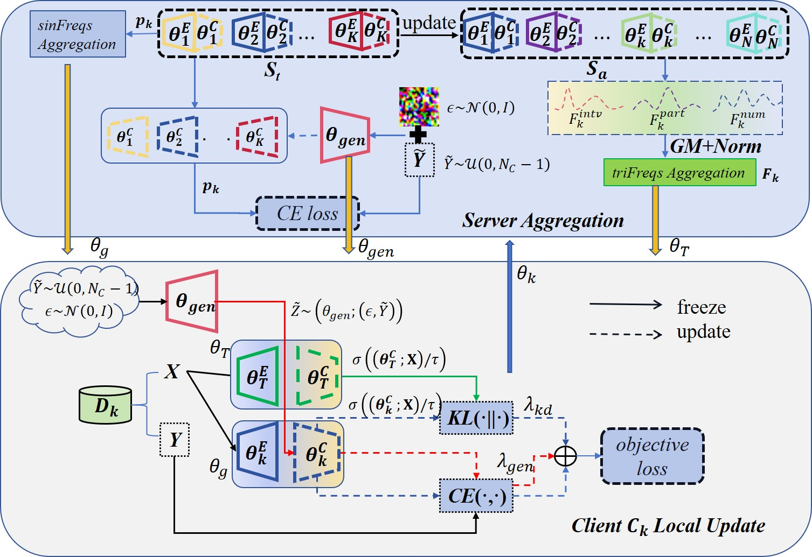

**Tackling Data Heterogeneity in Federated Learning
through Knowledge Distillation with Inequitable
Aggregation.**



## Setup

Clone the repo and install the required packages.
```
git clone https://github.com/maxiaum/KDIA
cd KDIA
conda create -n kdia python=3.9
conda activate kdia
pip install -r requirements.txt
```

## Training
The training script is in `run.sh`.

```
python main.py --dataset=cifar10 --resnet_model=0 --alg=kdia --lambda_kd=0.5 \
--lambda_gen=1.0 --lr=0.01 --epochs=10 --comm_round=200 --n_parties=100 \ --partition=noniid --beta=0.5 --logdir=logs/ --datadir=data/ --sample_fraction=0.1 \
--gpu=0 --init_seed=0 --remark=base

```

Key arguments:

- `dataset`: the name of dataset. We support 'cifar10', 'cifar100' and 'cinic10'.
- `alg`: the name of algorithm. We support 'fedavg', 'fedprox', 'fedavgm', 'fedgkd', 'feddisco', 'scaffold', and 'kdia'.
- `partition`: the data partitioning strategy, we support 'iid' and 'noniid'
- `beta`: the parameter for the dirichlet distribution for data partitioning.
- `resnet_model`: neural network used in training (simple-CNN).
- `n_parties`: the number of clients participated in federated learning.
- `sample_fraction`: the proportion of clients are sampled in each round.
- `epochs`: local iteration.
- `comm_round`: the number of maximum communication roun.
- `init_seed`: random seed.
- `logdir`: the log file path.
- `datadir`: the dataset file path.
- `remark`: the log file remark.
